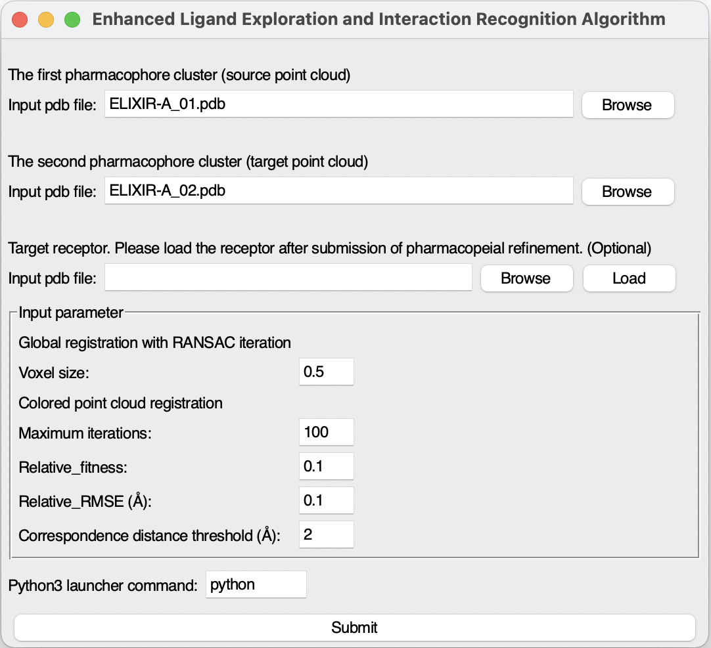
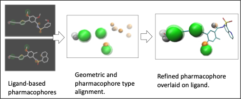

# ELIXIR-A
Enhanced Ligand Exploration and Interaction Recognition Algorithm (ELIXIR-A). ELIXIR-A, a plugin in [VMD](https://www.ks.uiuc.edu/Research/vmd/), can find similarities in the active site of the receptor under study compared to other receptors. 

# Overview
This is a  `Tcl/tk` and  `python` script for the identification of active sites and pharmacophores followed by ligand/inhibitor screening step. The package also provides an overall evaluation of the performance of the entire docking simulation.

- [Repo Contents](#Repo-Contents)
- [System Requirements](#System-requirements)
- [Installation Guide](#Installation-Guide)
- [Expected run time](#Expected-run-time)
- [Demo](#Demo)
- [License](#license)

# Repo Contents

- [ELIXIR](./ELIXIR0.9/): `Tcl/tk` source code with data input
- [Example](./Example/): Demo with sample inputs and outputs

# System Requirements
The package has been tested on the following systems:

- Linux:  Ubuntu 16.04  
- Linux:  Centos 3.10.0
- MacOS:  macOS Mojave

# Installation Guide
To run the script, you need to install python in your environment, python versions can be 3.7.4 or later. The numpy package version 1.17.2 or later is required to run the algorithm. 

To install python on OS X & Linux:

```sh
sudo apt-get install python3
```
If the python execute command is python3, change the 366th line of [ELIXIR/ELIXIR-A.tcl](./ELIXIR-A/ELIXIR/ELIXIR-A.tcl) from python to python3.
```
set output [exec python [file join $::env(ELIXIRDIR) "elixirA.py"] [expr {$::elixir::ph1index -1}] $::elixir::ph1indexs [expr {$::elixir::ph2index -1}] $::elixir::ph2indexs \
 $::elixir::ph1data $::elixir::ph2data $::elixir::outputfolder]
```
To python 3
```
set output [exec python3 [file join $::env(ELIXIRDIR) "elixirA.py"] [expr {$::elixir::ph1index -1}] $::elixir::ph1indexs [expr {$::elixir::ph2index -1}] $::elixir::ph2indexs \
 $::elixir::ph1data $::elixir::ph2data $::elixir::outputfolder]
```
 
To install numpy package on OS X & Linux:

```sh
sudo apt install python3-pip
pip install numpy
```

## [VMD](https://www.ks.uiuc.edu/Research/vmd/)  1.9.2 or later
In VMD, place the [ELIXIR1.0](https://github.com/sfernando-BAEN/ELIXIR-A/releases/tag/v1.0) folder to VMD TCL plugins directory ```/plugins/noarch/tcl/```

Add the command in file ```/scripts/vmd/loadplugin.tcl.```

Under  line 
```sh
### Modeling menu 
```
Add 
```sh
vmd_install_extension elixir elixir_tk  "Modeling/ELIXIR-A"
```

If the package has been successfully installed, ```ELIXIR-A``` can be found under the Extensions-Modelling tab.


# Installation time
The total installation time will be about 10 minutes to install all the necessary packages.

# Expected run time
The expected run time should be less than a minute. (max pharmacophores for each binding site)

# Demo
This demonstration uses ELIXIR-A to find refined pharmacophores from the RNA polymerase between [SARS-CoV-2](https://www.rcsb.org/structure/7BW4) and [dengue viruses](https://www.rcsb.org/structure/6IZX).

### Step 1. Load the first pharmacophore file [Den_ELIXIR-A.pdb](./Example/Input/Den_ELIXIR-A.pdb) with ``` Import from pdb ``` icon at the first pharmacophore cluster area.

### Step 2. Load the second pharmacophore file [CoV2_ELIXIR-A.pdb](./Example/Input/CoV2_ELIXIR-A.pdb) with ``` Import from pdb ``` icon  at the second pharmacophore cluster area. 
In VMD OpenGL Display window, the first pharmacophore cluster will be shown as green Van der Waals balls and the second ones will be shown as red Van der Waals balls. The pharmacophore files can be generated by [DruGUI](http://prody.csb.pitt.edu/drugui/) plugin or interactive [Pharmit](http://pharmit.csb.pitt.edu) platform using ligand/inhibitor binding structure. The pharmacophores from pharmit or other softwares can be manually added to ELIXIR-A. 


Pharmacophore clusters have been loaded.

### Step 3. Run the ELIXIR-A by clicking  ```Submit``` icon.

Output pharmacophores (yellow) have been generated and shown in VMD OpenGL Display window.

Viewed by [Schrödinger Maestro](https://www.schrodinger.com/maestro). The dengue receptor is in gray. SARS-CoV pharmacophore cluster (red) show some similar binding activities to dengue pharmacophore cluster (green).

# License
+ [Apache-2.0 License](./LICENSE)
