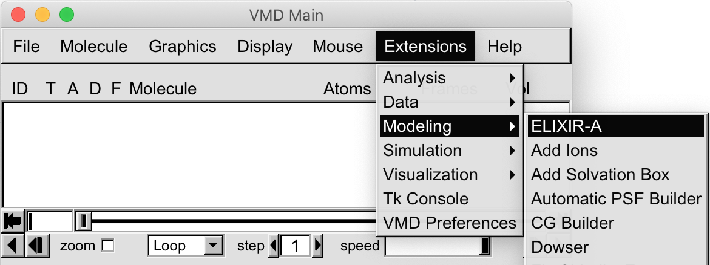

# ELIXIR-A
Enhanced Ligand Exploration and Interaction Recognition Algorithm (ELIXIR-A). ELIXIR-A, a plugin in [VMD](https://www.ks.uiuc.edu/Research/vmd/), can find similarities in the active site of the receptor under study compared to other receptors. 

# Overview
This is a  `Tcl/tk` script for the identification of active sites and pharmacophores followed by ligand/inhibitor screening step. The package also provides an overall evaluation of the performance of the entire docking simulation.

- [Repo Contents](#Repo-Contents)
- [System Requirements](#System-requirements)
- [Installation Guide](#Installation-Guide)
- [Expected run time](#Expected-run-time)
- [Demo batch docking procedures](#Demo-batch-docking-procedures)
- [License](#license)

# Repo Contents

- [ELIXIR](./ELIXIR0.9/): `Tcl/tk` source code with data input
- [Example](./Example/): Demo with sample inputs and outputs

# System Requirements
The package has been tested on the following systems:

- Linux:  Ubuntu 16.04  
- Linux:  Centos 3.10.0
- MacOS:  macOS Mojave

# Installation Guide
To run the script, you need to install python in your environment, python versions can be 2.7.16, 3.7.4 or later. The numpy package version 1.17.2 or later is required to run the algorithm. 

To install python on OS X & Linux:

```sh
sudo apt-get install python3
```

To install numpy package on OS X & Linux:

```sh
sudo apt install python3-pip
pip install numpy
```

## [VMD](https://www.ks.uiuc.edu/Research/vmd/)  1.9.2 or later
In VMD, place the [ELIXIR0.9](./ELIXIR0.9/) folder to VMD TCL plugins directory ```/plugins/noarch/tcl/```

Add the command in file ```/scripts/vmd/loadplugin.tcl.```

Under  line 
```sh
### Modeling menu 
```
Add 
```sh
vmd_install_extension elixir elixir_tk  "Modeling/ELIXIR-A"
```

If the package has been successfully installed, ```ELIXIR-A``` can be found under the Extensions-Modelling tab.



# License
+ [Apache-2.0 License](./LICENSE)
